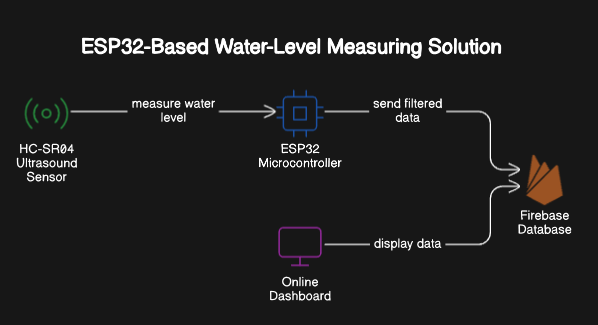

# ESP32-Based Water-Level Measuring Application
## 1. Introduction
- **Purpose**: Measuring the water level in the tank, when refilling it. Set an alarm on the dashboard, and ring the buzzer
if the water is going to overflow.

## 2. System Overview
- **Hardware Architecture**:

- **Key Components**: 
    - ESP32 Microcontroller
    - HC-SR04 Ultrasound Sensor
    - Buzzer
    - Firebase Database
    - Online Dashboard

- **Software Architecture**:

## 3. Detailed Design
### 3.1 Sensor Data Acquisition
- **Description**: 
- **Data Flow**: 
- **Error Handling**:
### 3.2 Data Filtering and Processing
- **Description**: 
- **Algorithms Used**: 
- **Performance Considerations**:
### 3.3 Data Transmission to Firebase
- **Description**: 
- **Communication Protocols**: 
- **Error Handling and Retries**:
### 3.4 Dashboard Data Visualization
- **Description**: 
- **User Interface Design**: 
- **Frontend Libraries**:

## 4. Security Considerations
- **Data Protection**: 
- **Authentication and Authorization**:

## 5. Performance Metrics
- **Sensor Accuracy**: 
- **Data Transmission Latency**: